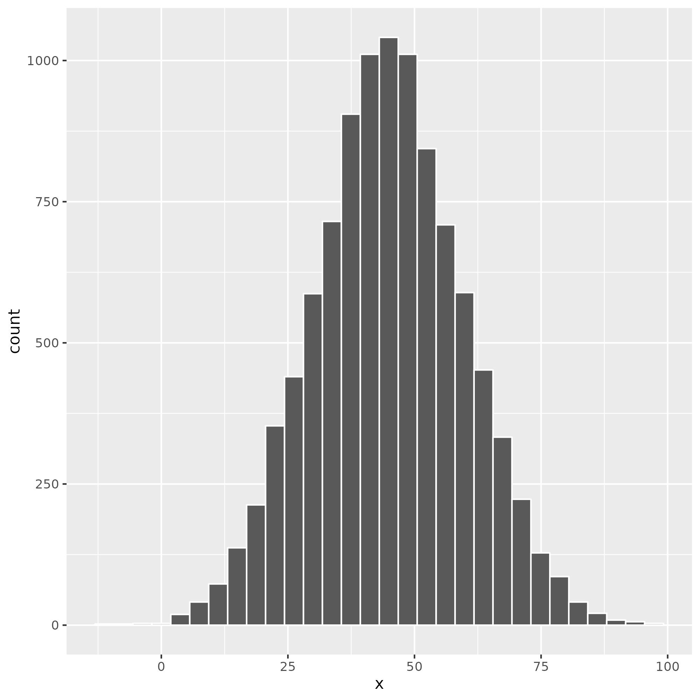
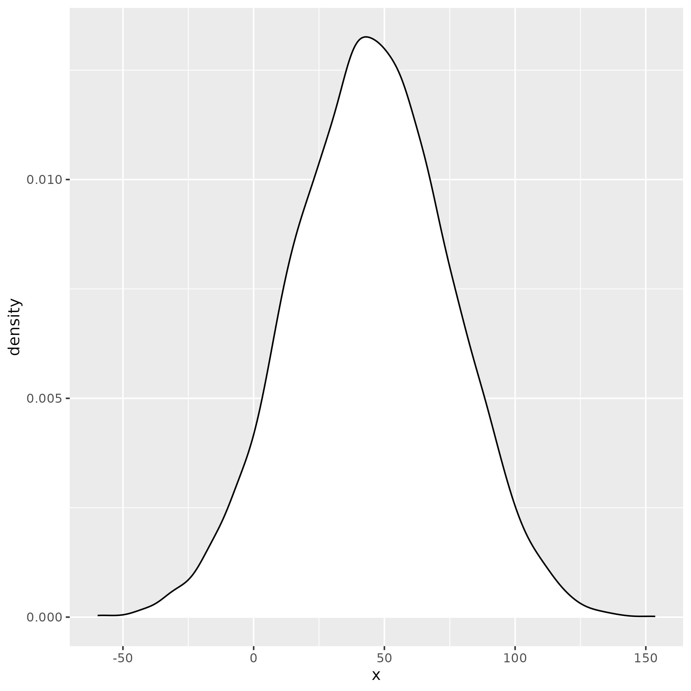
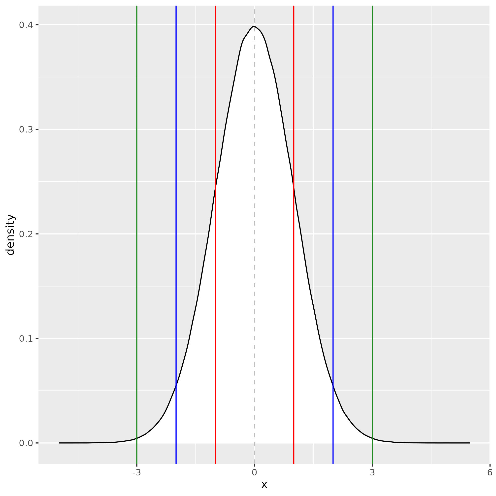
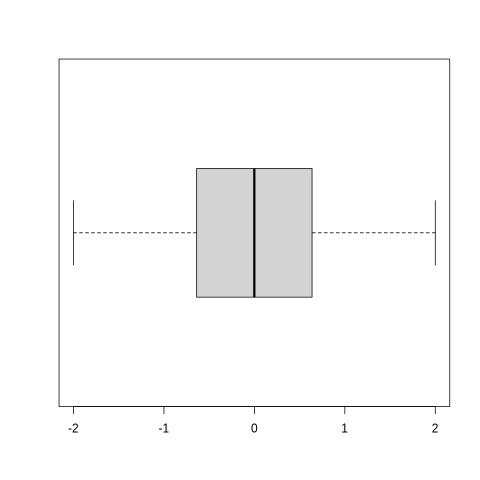

# Univariate Analysis
- This refers to single variable. Examine variables one at a time.

## Data Types 
- Numeric (quantitative)
     + Continuous
     + Count (discrete)
- Categorical (qualitative)
     + Binary
     + Non-binary
     + Nominal
     + Ordinal

## Some math concepts
### Scientific notation
- $1e+2 = 1 * 10^2 = 100$
- $7658 = 7.652 * 1000 = 7.652 * 10^3 = 7.652e+3$
- $0.0008716 = 8.716/10000 = 8.716*10^{-4} = 8.716e-4$

### The multiplication operator
- \* The asterisk

### The concept of summation
- If you have a group of numbers \[3, 4, 2, 5, 6\] you can ordinarily sum them by adding the first number, to the second number till the last. That means each number has an index
- Index is written as *i*
- The last number is referred to as having index *n* or the *nth* number. In our example, the index of the numbers is:
    + 3 has index 1 (*i* = 1)
    + 4 has index 2 (*i* = 2)
    + 2 has index 3 (*i* = 3)
    + 5 has index 4 (*i* = 4)
    + 6 which is the *nth* number in the set has an index 5 (*i* = *n* = 5)

- If we call these numbers *x* then *x* = \[3, 4, 2, 5, 6\]
- $x_{i=1} = 3$, $x_{i=2} = 4$, $x_{i=3} = 2$, $x_{i=4} = 5$ and $x_{i=5} = 6$
- The last number can be written as $x_n = 6$ or $x_{i=n} = 6$
- The sum of the numbers may be written as $3 + 4 + 2 + 5 + 6$ or as
-  $x_{i=1} + x_{i=2} + x_{i=3} + x_{i=4} + x_{i=5}$ or as
- $x_{i=1} + ... x_{i=n}$
- There is a symbol for summation $\sum$
- Writing the sum of a group of numbers would then be written as

$\sum_{i=1}^{i=n}{x_i}$

### Numeric measures

##### Extremes and Range
- If we arrange numbers that are grouped the smallest least number is referred to as the minimum while the greatest or largest number is referred to as the maximum
- The range for the group of numbers will then be $maximum - minimum$

##### Quantiles
- This refers to portions of groups of numbers an example would be school exams we may refer to the top half of the class and the bottom half after a test.
- This example would be referred to as halves which are in other words 2 quantiles.
- If we can identify the score that separates the class into 2 halves then we would use that to determine the bottom and top half.

__Example__:

$Scores = [23, 65, 44, 19, 19, 28, 62, 77, 81, 55, 29, 92, 96, 48, 43, 51, 51, 55, 61]$

To determine the halves we would first need to sort the numbers from lowest to highest:

$Scores = [19, 19, 23, 28, 29, 43, 44, 48, 51, 51, 55, 55, 61, 62, 65, 77, 81, 92, 96]$ 

We can see here that 

$Scores_i = 19$ 

and 

$n = 19$ 

and we can find the center by dividing 

$n/2 = 9.5$ 

That puts the center at 

$Scores_{10}$    

Based on this we can determine anyone who scored less than 51 is in the bottom half of the class and anyone who scored above 51 is in the top half of the class.

Other quantiles are named:
- 3 parts = tertiles
- 4 parts = quartiles
- 5 parts = pentiles or quintiles
- 10 parts = deciles and
- 100 parts = percentiles

- We often hear of percentiles so the next time you hear that someone was in the top 15 percentile it means the person did better than 85% of the people in the same group.
- Percentiles are how things like cut-off marks are set for school admissions.

##### Quartiles
- Let's consider the $Scores$ example again. If we want to split into quartiles we will have four parts by dividing by $n/5$:
- $Q1 = 29$
- $Q2 = 51$
- $Q3 = 65$
- $Q4 = 96$

- These may be interpreted as percentiles also
- $Q1 = 25^{th} percentile$
- $Q2 = 50^{th} percentile$
- $Q3 = 75^{th} percentile$
- $Q4 = 100^{th} percentile$

### Numeric Center
- $Q2$ as we see is the center of the numeric data and is also called the **Median**. It is often referred to as the true center of a numeric data set.
- There are other measures. One very popular one is the average which is obtained by adding all the members of a group and dividing by the number of values in the group
- Example the average of $x = [3, 6, 5]$ will be $(x_{i=1} + x_{i=2} + x_{i=3})/3$ same as $(x_{i=1} + x_{i=2} + x_{i=3})/n$
- Remember the way we write summation? Let's use this:

$$\bar{x} = {\sum_{i=1}^{i=n}{x_i}\over{n}}$$
- The arithmetic average is called the **Mean**
- We have learned of two types of measures for the center of date and these are the **Median** (Q2) and the **Mean** (average).

### Numeric Distributions 
- We can look at numeric data in graphical forms to see how frequently (frequency) each number or group of numbers occurs.

**Fig1: Normal Disribution**

**Fig2: Bell Curve**

- When we create a histogram and it looks like a bell then we say it is normally distributed.
- These types of numeric distributions tend to occur a lot in random phenomena in nature.
- What we consider *normal* tends to cluster in the center and be more than the extremes that we consider abnormal. We can come up with a lot of examples.

### Numeric spread
- When we think about numbers in quartiles we can immediately imagine the central half or 50%.
- This is easily calculated by subtracting $Q1$ from $Q3$ that is $Q3 - Q1$ and this is called the interquartile range

$$IQR = Q3 - Q1$$

- The mean does not always coincide with the median. However when data is normally distributed the mean and median will coincide or be approximately equal.
- When this happens the data spread can be described in terms of the bell curve with 1 standard deviation (the inflection point of the curve) representing the central 68% of the data
- If we measure from the center to that point and multiply by two (2 standard deviations) the boundaries represent the central 95% of the data
- When we move to three standard deviations then our new boundaries  represent the central 99.7% of data.

**Fig3. Standard Deviations**

## Single Numeric Variable
- Look for the percentage missing
- $MissingPercentage = (numberMissing/numberOfObservations) * 100$
- Next, we check the distribution to see if :
    + Normally distributed (report the mean as the center and standard deviation as the spread)
    + Not normally distributed (report the median as the center and the IQR as the spread)
- Report the **Five Number Summary**
    + Minimum
    + Q1 (First quartile)
    + Median (Q2)
    + Q3 (Third quartile)
    + Maximum
- Additional measures that may be of interest:
- $Range = Maximum - Minimum$
- Finally, we visualize numeric variables as a visual representation of the five-number summary

**Fig4. Boxplot**

- Depending on if the box is closer to the left or the right we can describe the data as left or right-skewed.

