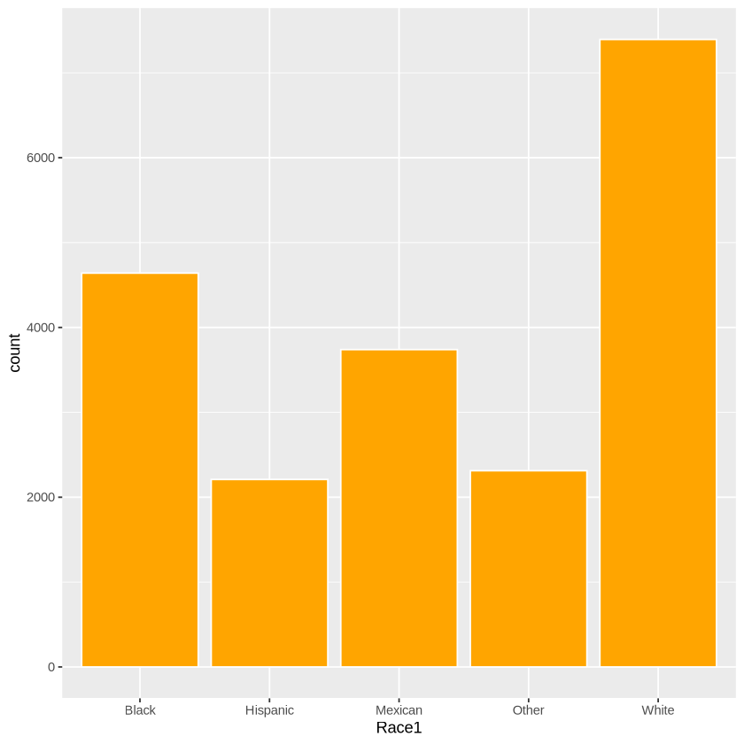
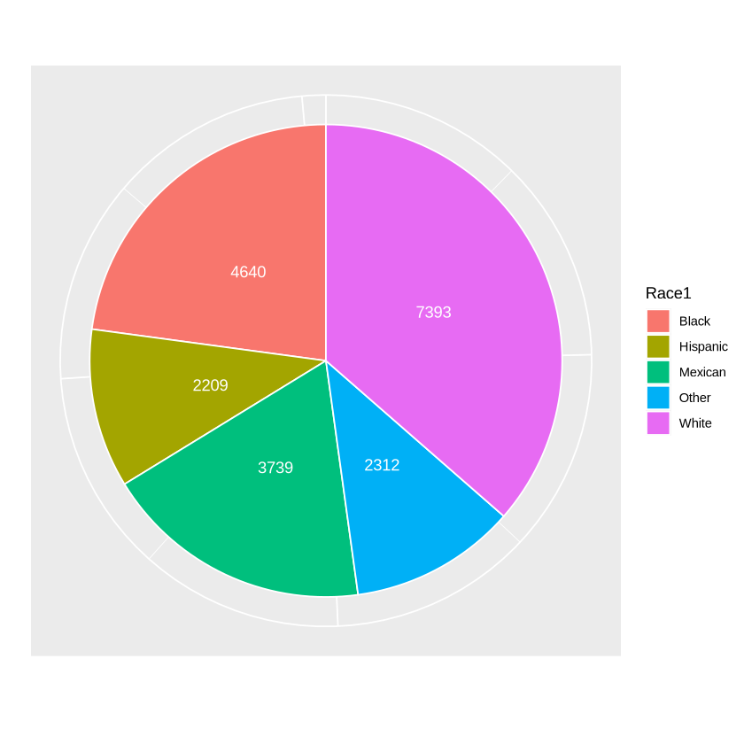

# Univariate Analysis
- We started out by looking at analyzing a single numeric variable.
- In summary, we said you need to:
    + Identify the level of missingness
    + Identify the type of distribution you are dealing with (Normal or Not)
    + Get the five-number summary for the numeric variable (in, Q1, median, Q3 and maximum)
    + Report the center and the spread (mean and standard deviation for normal distributions, or median and IQR for non-normal distributions)
- Now let's look at categorical variables

## Categorical variable
- Once more we begin by identifying the level of missingness
- Next, we identify how many levels there are
- If the levels are too many we may consider grouping
- We want to count the number for each level - this is referred to as the **Frequency**
- Next, we calculate the proportion each level contributes to the total
  $Proportion = NumberInLevel/TotalNumber$

  Proportions are usually between 0 and 1 
- We can then calculate the percentage each level contributes
$Percentage = Proportion * 100$

So percentages are usually between 0 and 100

- We visualize categorical variables using:
    + Bar charts

    

    + Pie charts
 
    

