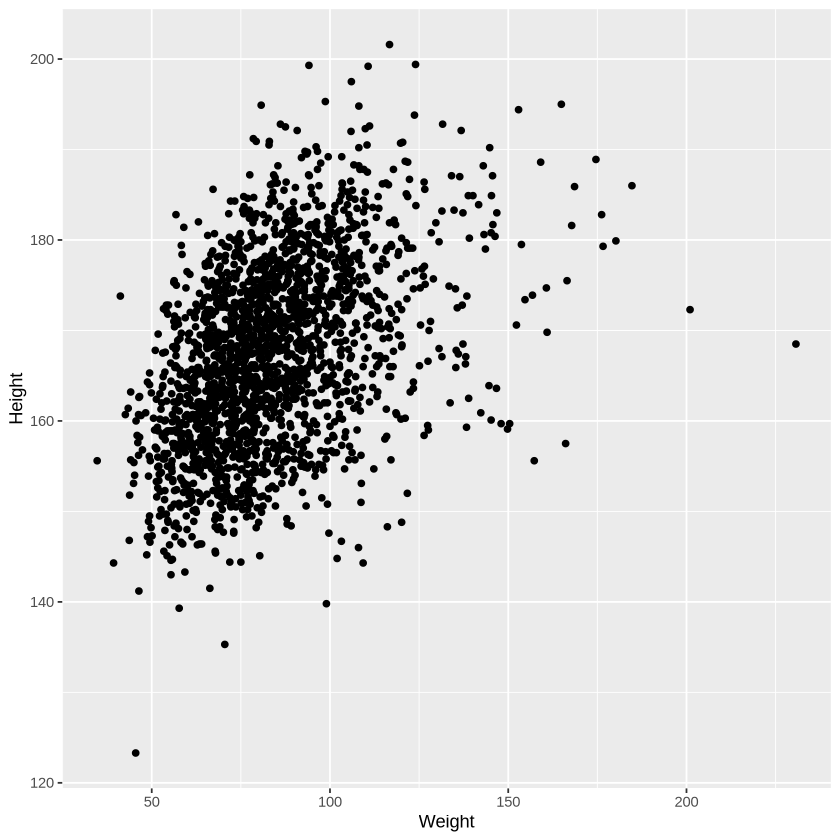
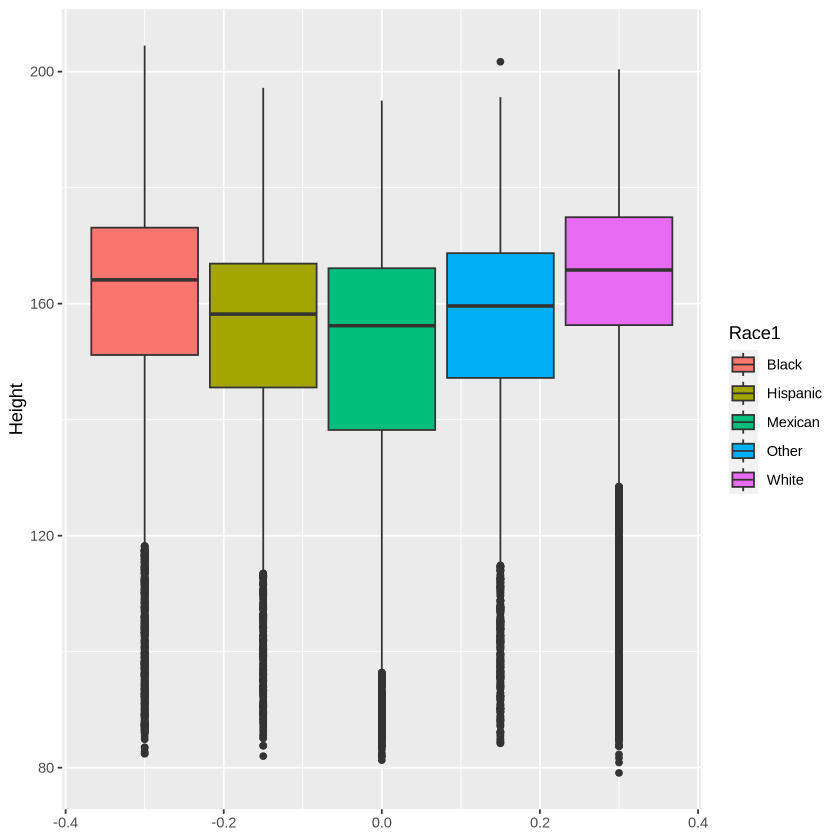

# Bivariate Analysis
- Very often when data is analyzed it in because of some variable of interest such as:
    + Volume of sales
    + Number of clients
    + Patients with a disease condition (prevalence)
    + etc
- Sometimes it is something called an association or causal study:
    + Does this drug treat this illness? (Clinical trial)
    + Does an intervention produce the desired result eg Implementation of speed limits and sensors and car crash reduction
    + Does the new campaign result in increased sales?
 
- In either case, we find we will end up comparing the variable of interest with other variables or outrightly comparing two variables.
- This kind of data analysis is called **Bivariate Analysis**.
- There are three possible combinations:
    + Numeric vs Numeric
    + Numeric vs Categorical
    + Categorical vs Categorical

### Numeric vs Numeric
- Here we consider two numeric variables. An example may be checking to see how discount affects sales.
- The measure of interest in this case is **correlation**: does a change in one numeric variable affect the second variable?
- Examples of correlation may be:
    + When one variable moves in one direction the other moves in the opposite direction. Remember the saying "The higher you go the cooler it becomes". This suggests that as altitude increases, temperature drops. So they move in opposite directions and have what is referred to as a **negative correlation**.
    + Another saying is "the harder you work, the more you earn". This suggests that if you work longer hours, for example, you are more likely to earn more. And if you work less then you will earn less. So the two variables move together. this kind of correlation is said to be **positive correlation**.
    + There is yet another saying "How does your worrying affect the price of fish in the market?" the point is whether you worry or not has no impact on the price of fish. They are "independent" of each other hence there is **no correlation**.
- We won't go into the knots and bolts of calculating correlation but there is a measure for it and it ranges from -1 through 0 to +1.
    + Negative correlation ranges from -1 to 0
    + Positive correlation ranges from 0 to +1
    + The closer to zero the weaker the correlation with zero meaning no correlation whatsoever.
    + Remember that

      $Correlation \ne Causation$
    + Check out some [spurious correlations](https://tylervigen.com/spurious-correlations)

- Visually we view correlations as scatter plots

- A regression line may help see the correlation more clearly

## Numeric vs Categorical 
- Here we simply report the numeric summaries at each level of the categorical variable
- If comparing Gender to height then we will look at the five-number summary for males and compare it to that for females.
- More importantly, we will compare the center and spread for each sex
- Visually we look at grouped boxplots.

