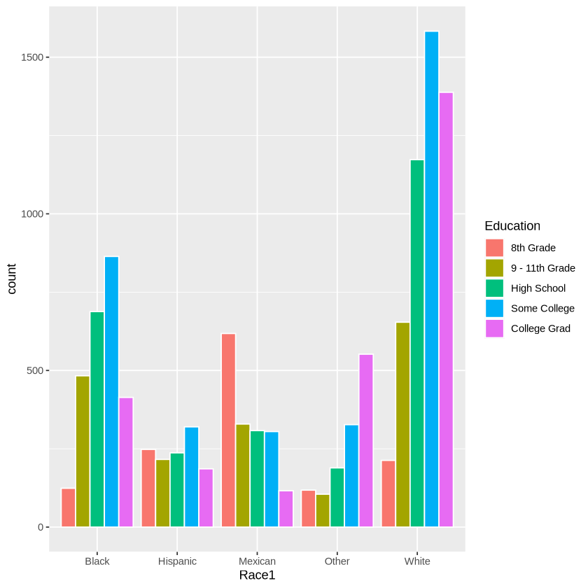
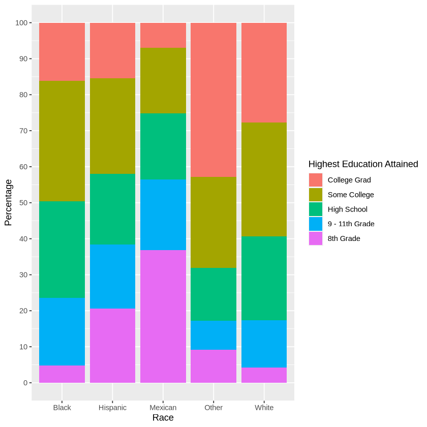

# Categorical vs Categorical
- Here we create contingency tables.
- We calculate frquencies proportions and percentages
- We may also calculate row or column percentages depending on what we want to highlight
- We may plot these as:
1. Grouped bar charts (especially when looking at frequencies or percentages of the total)
 

2. Stacked bar charts (especially when looking at marginal probabilites)
 
