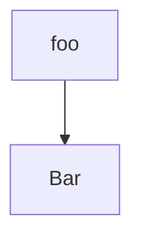

# DataAnalyst
2024 Training - Data Analysts Skills - Statistics, R Programming Language, SQL and Tableau for Data Visualization.

## Remember
- Create a free account on [Posit.Cloud](https://posit.cloud)
- Create a free account on [Tableau Public](https://public.tableau.com)

## Cool group to join online
- [Posit Data Science meetup](https://zoom.us/j/97420354693)

